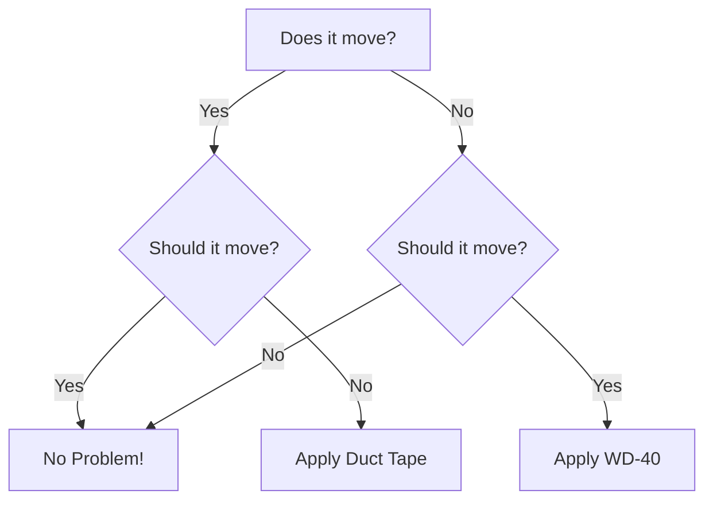

# {{page.title}}

Here is a cool new project for me. I always wanted to carve-out a little
space on the internet to display projects and stuff.

So, the idea here is to put together a site to facilitate the
documentation of embedded systems projects and electronic stuff in
general.

It leverages Jekyll with the addition of mermaid and wavedrom. Here are
some examples:


## Timing diagrams:

First order of business: timing diagrams. Here is wavedrom.

This code:

```javascript
{ "signal": [
  { "name": "clk",  "wave": "p.....|..." },
  { "name": "data", "wave": "x.345x|=.x", "data": ["some", "data", "on the", "bus"] },
  { "name": "req",  "wave": "0.1..0|1.0" },
  { "name": "ack",  "wave": "1.....|01." }
]}
```

Renders like this:
```wavedrom
{ "signal": [
  { "name": "clk",  "wave": "p.....|..." },
  { "name": "data", "wave": "x.345x|=.x", "data": ["some", "data", "on the", "bus"] },
  { "name": "req",  "wave": "0.1..0|1.0" },
  { "name": "ack",  "wave": "1.....|01." }
]}
```

## Graphs with mermaid

Here is some classic "debugging" flowcharting with mermaid.

This mermaid code:
```
graph TD
    A[Does it move?] -->|Yes| B{Should it move?}
    A -->|No| C{Should it move?}
    
    B -->|Yes| D[No Problem!]
    B -->|No| E[Apply Duct Tape]
    
    C -->|Yes| F[Apply WD-40]
    C -->|No| D[No Problem!]
```




## Classic $\LaTeX$

Who does not love $\LaTeX$? It looks like this is supported too, let's start with a cool integral:

$$
\int_{-\infty}^{\infty} e^{-x^2} dx
$$

Now add some cordic computations:

$$
\begin{equation}
\begin{bmatrix}
x_n \\
y_n
\end{bmatrix} =
K_{fixed}
\cdot
\prod_{i=0}^{n-1} 
\begin{bmatrix}
1 & \sigma \cdot \tan(\theta_i) \\
-\sigma \cdot \tan(\theta_i) & 1
\end{bmatrix} 
\cdot
\begin{bmatrix}
x_0 \\
y_0
\end{bmatrix}
\end{equation}
$$


[Visit Project](https://example.com)


