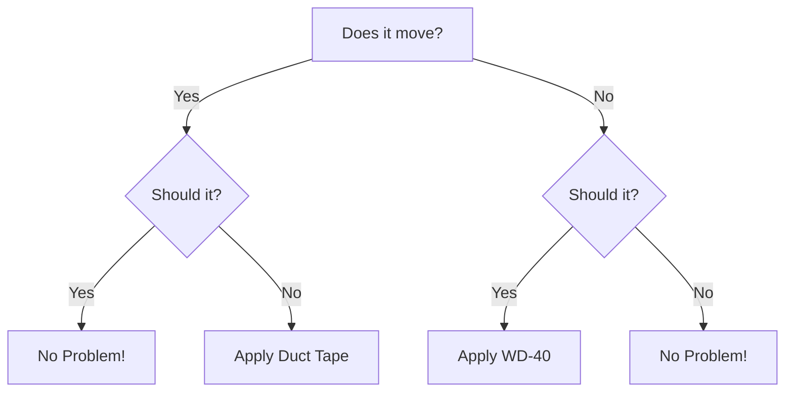

<!-- Banner Image -->
<div style="
  background-image: url('{{ '/assets/images/optimization.webp' | relative_url }}');
  background-size: cover;
  background-position: center;
  height: 200px; /* Adjust height as needed */
">
</div>



# {{page.title}}

Here is a cool new project. It is a portfolio, complete with electronic
design documentation features and free webhosting on github.

The main idea that sparked this project was to carve-out a little
space on the internet to display realisations and general stuff.

As you see here, it was very easy to put together a site to facilitate
the documentation of embedded systems projects and electronic stuff in
general. The real kicker is that GitHub will let you host this kind of
Jekyll website directly from your account. So you edit, commit, push/pull
and the build process is automated up to the deploy. This looked like
the perfect medium for a portfolio. So let the experimentation begin!

### Cloning this site

Feel free to [clone this repo](https://github.com/fperron-kt88/fx-portfolio)
and add your own content. The license configured should let you start your own version
of this easily. Let me know if you have questions about this, you can
[reach me here on my linkedin for that](https://linkedin.com/in/francoisperron).

### Note on installation

This site leverages Jekyll with the addition of mermaid and wavedrom.
It is essentially built with markdown with a few touches of html or
javascript here and there. It turns out that this syntactic sugar is
very efficient and clean. Some $\LaTeX$ is sprinkled as well. Here are
some examples below that should help getting started.

I have not yet produced the instructions to reproduce this. It was
put together as a quick experiment during the course of a single day
(I admit it was a busy one, though...) and I will certainly give a few
pointers if you ask me for them. See contact info above.

## Timing diagrams:

First order of business: timing diagrams. They are super useful to
represent timming issues found while debugging or as a straight-up
documentation tool for architecture and design.

This wavedrom [tutorial](https://wavedrom.com/tutorial.html) is very informative.

Here is one example:

```wavedrom
{ "signal": [
  { "name": "clk",  "wave": "p.....|..." },
  { "name": "data", "wave": "x.345.x|=.x", "data": ["put", "some", "data", "here"] },
  { "name": "req",  "wave": "0.1...0|1.0", node: '..a.......' },
  { "name": "ack",  "wave": "1......|01.", node: '........b.' }
],
edge: ['a~>b t1: max 80ns']}
```

Produced with this block of code:

````
```wavedrom
{ "signal": [
  { "name": "clk",  "wave": "p.....|..." },
  { "name": "data", "wave": "x.345.x|=.x", "data": ["put", "some", "data", "here"] },
  { "name": "req",  "wave": "0.1...0|1.0", node: '..a.......' },
  { "name": "ack",  "wave": "1......|01.", node: '........b.' }
],
edge: ['a~>b t1: max 80ns']}
```
````

Nice, innit?

## Graphs with mermaid

Here is a remake of the classic engineering flowchart with mermaid:



There, got that fixed for you ;-)


The block of code is:
````

````



## Classic $\LaTeX$

Who does not love $\LaTeX$? It looks like this is supported too, let's start with an inline equation:

We can just render inline: $e^{j\pi}+1=0$ or then display a cool integral like this:


$$
\int_{-\infty}^{\infty} e^{-x^2} dx
$$

How about adding some cordic computations with this block:

$$
\begin{equation}
\begin{bmatrix}
x_n \\
y_n
\end{bmatrix} =
K_{fixed}
\cdot
\prod_{i=0}^{n-1} 
\begin{bmatrix}
1 & \sigma \cdot \tan(\theta_i) \\
-\sigma \cdot \tan(\theta_i) & 1
\end{bmatrix} 
\cdot
\begin{bmatrix}
x_0 \\
y_0
\end{bmatrix}
\end{equation}
$$

Then some binary/hex arithmetics:

$$
\begin{array}{rcl}
\text{Decimal:}         & -48 & \\
\text{Binary (+48):}    & \phantom{+} 0000\ 0000\ 0011\ 0000 & \text{(16-bit)} \\
\\
\text{Invert:}          & \phantom{+} 1111\ 1111\ 1100\ 1111 & \\
\text{Add 1:}           & +           0000\ 0000\ 0000\ 0001 & \\
\hline
\text{Result:}          & \phantom{+} 1111\ 1111\ 1101\ 0000 & \text{(Two's complement)} \\
\text{Hex:}             & \texttt{0xFFD0} \\
\end{array}
$$

All very clear!

### Code snippets for the $\LaTeX$ above:

The literal inline form for the equation: `$e^{j\pi}+1=0$`  

The code block for the integral:
```
$$
\int_{-\infty}^{\infty} e^{-x^2} dx
$$
````

The cordic matrix multiplication:

````
$$
\begin{equation}
\begin{bmatrix}
x_n \\
y_n
\end{bmatrix} =
K_{fixed}
\cdot
\prod_{i=0}^{n-1} 
\begin{bmatrix}
1 & \sigma \cdot \tan(\theta_i) \\
-\sigma \cdot \tan(\theta_i) & 1
\end{bmatrix} 
\cdot
\begin{bmatrix}
x_0 \\
y_0
\end{bmatrix}
\end{equation}
$$
````

The binary and hexadecimal arithmetics:
````
$$
\begin{array}{rcl}
\text{Decimal:}         & -48 & \\
\text{Binary (+48):}    & \phantom{+} 0000\ 0000\ 0011\ 0000 & \text{(16-bit)} \\
\\
\text{Invert:}          & \phantom{+} 1111\ 1111\ 1100\ 1111 & \\
\text{Add 1:}           & +           0000\ 0000\ 0000\ 0001 & \\
\hline
\text{Result:}          & \phantom{+} 1111\ 1111\ 1101\ 0000 & \text{(Two's complement)} \\
\text{Hex:}             & \texttt{0xFFD0} \\
\end{array}
$$
````
