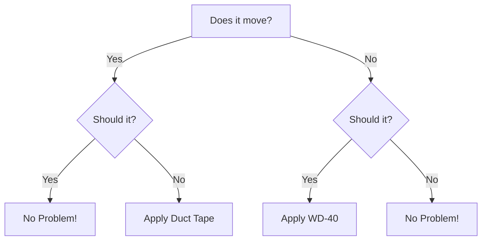

# {{page.title}}

<!-- Banner Image -->
<div style="
  background-image: url('{{ '/assets/images/optimization.webp' | relative_url }}');
  background-size: cover;
  background-position: center;
  height: 200px; /* Adjust height as needed */
">
</div>



Here is a cool new project. The main idea is to carve-out a little
space on the internet to display projects and stuff.

So, let's put together a site to facilitate the
documentation of embedded systems projects and electronic stuff in
general. It turns out that this portfolio is the perfect medium for
that. Let the experimentation begin!

This site leverages Jekyll with the addition of mermaid and wavedrom.
It is essentially built with markdown with a few touches of html or
javascript here and there. It turns out that this syntactic sugar is
very efficient and clean. Some $\LaTeX$ is sprinkled as well. Here are
some examples.

## Timing diagrams:

First order of business: timing diagrams. Here is wavedrom.

This code:

```javascript
{ "signal": [
  { "name": "clk",  "wave": "p.....|..." },
  { "name": "data", "wave": "x.345.x|=.x", "data": ["some", "data", "on the", "bus"] },
  { "name": "req",  "wave": "0.1...0|1.0" },
  { "name": "ack",  "wave": "1......|01." }
]}
```

Renders like this:
```wavedrom
{ "signal": [
  { "name": "clk",  "wave": "p.....|..." },
  { "name": "data", "wave": "x.345.x|=.x", "data": ["some", "data", "on the", "bus"] },
  { "name": "req",  "wave": "0.1...0|1.0" },
  { "name": "ack",  "wave": "1......|01." }
]}
```

This is super usefull to represent timming issues found while debugging
or as a straight-up documentation tool for architecture and design.

## Graphs with mermaid

Here is a remake of the classic engineering flowchart with mermaid.

This mermaid code:
```
graph TD
    A[Does it move?] -->|Yes| B{Should it?}
    A -->|No| C{Should it?}
    
    B -->|Yes| D[No Problem!]
    B -->|No| E[Apply Duct Tape]
    
    C -->|Yes| F[Apply WD-40]
    C -->|No| G[No Problem!]
```

Renders as:

There, got that fixed for you ;-)



## Classic $\LaTeX$

Who does not love $\LaTeX$? It looks like this is supported too, let's start with a cool integral:

$$
\int_{-\infty}^{\infty} e^{-x^2} dx
$$

Now add some cordic computations:

$$
\begin{equation}
\begin{bmatrix}
x_n \\
y_n
\end{bmatrix} =
K_{fixed}
\cdot
\prod_{i=0}^{n-1} 
\begin{bmatrix}
1 & \sigma \cdot \tan(\theta_i) \\
-\sigma \cdot \tan(\theta_i) & 1
\end{bmatrix} 
\cdot
\begin{bmatrix}
x_0 \\
y_0
\end{bmatrix}
\end{equation}
$$

It looks like we have a good templating system to convey ideas and properly document stuff!

