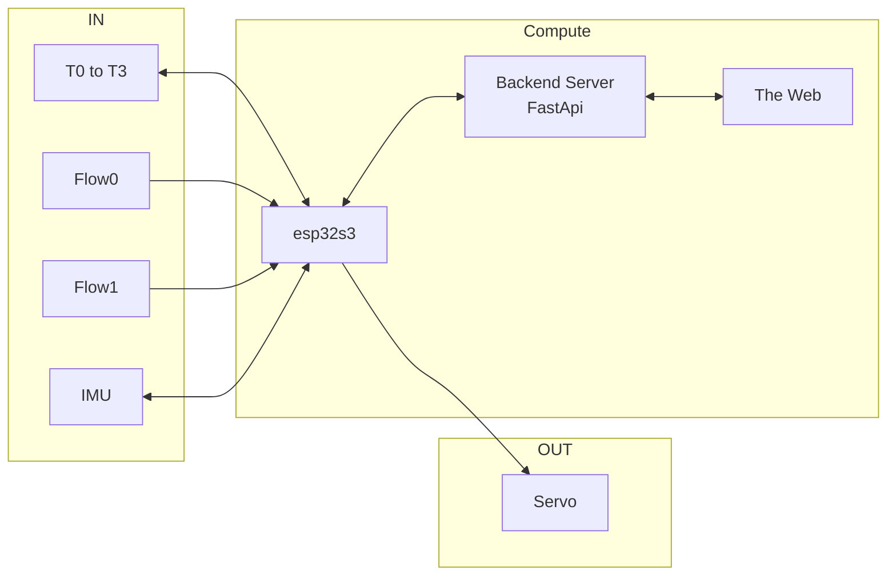
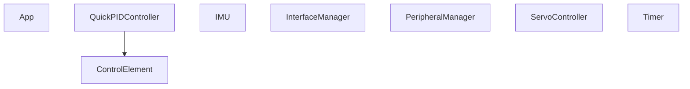
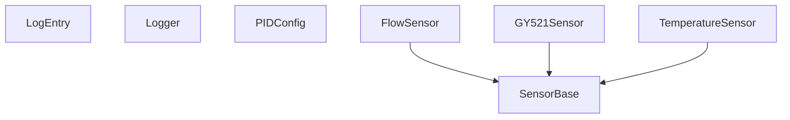

  

    
  

  

    
  





# {{page.title}}

Here is a recent one. The code is [in this github repo](https://github.com/fperron-kt88/fx-grpc-auto-detect).

  

    
    
  

This is the story of the refactoring of a double flow rate and quadruple
temperature sensing MCU on bare metal. It interfaces through grpc on
serial to a fast API backend and out to the web. An IMU and a servo were
also added, for reasons that will become apparent later.

When exposing sensors on the internet, this setup is common and effective.
Running bare metal on the MCU comes with a few responsibilities and
one could argue that an RTOS could have been a sensible choice here.
For this system though, free cycles were simply used to integrate the
inertial platform and a servo to form a tight PID loop that turned very
useful for debugging. More on this later. In hindsight, there would have
been ample space for an RTOS. So, that seed is planted now.

Let's first describe the system in its first iteration as a viable
IoT interface and for this first jot in C++.

## General concept

The system is comprised of sensors (IN), actuators (OUT) and Computing
elements. The link between the esp32 and the backend is over serial at
115 200 Baud and the backend exposes the API over https.

Not represented in the drawing, but shown in the screenshots above, is
a minimal streamlit application that displays live data.

## Desired features

The refactor had to:

- Serve the grpc protocol to interface with the backend
- Implement the full resolution from an arbitrary number of digital temperature probes
- Measure 2 liquid flows with constant minimal resolution
- Maintain a very clear identification of:
    - any connected device (multiple esp32 could be present on the usb bus)
    - a build id
    - an API version
- Free-up sufficient computing power to maintain a PID loop in function with very smooth operation

## Software architecture

Before diving into deeper system details, let's have an overview of
the main software components. The toolchain used is platformio but the
arduino frameword was kept as it enalbed a very quick integration path
with librairies that were known to work well with the interface to the
temperature sensors' one-wire protocol, the servo using pwm on timers,
the IMU on i2c and the backend on serial.

The idea here waws to provide a solid first interface with the least
amount of effort. And that worked.

### Main structure

The App class is a classic setup() and loop() interface and serves as a
main entry point. The setup phase enables installing various interrupt
routines and configure the GPIOs of the device. The loop serves all the
objects periodically and waits for updates on timed or interrupted events.

### Sensors

The class hierarchy of the project was elaborated to represent sensors
and control elements. The sensor class was derived the most, with the
definition of a FlowSensor, a TemperatureSensor and a GY521Sensor.

The abstraction of a ControlElement was thought to be a good base
to elaborate filters, PID controllers and general signal handling
black-boxes. The initial intent was to develop a registry and to enable
the composition of signal chains. While implemented from the begining, the
idea was left aside temporarily and to prioritize the basic functionality.

The IMU, based on a kalman filter, was implemented using the gyro sensor
as an input and abstracted independantly to provide sensor fusion. The
gyro used has 6 axis: acceleration and velocity respectively for the x,
y and z axis. 

A PeripheralManager class is in charge of setting up all sensors and
configuring the chip.

### Interfaces

The grpc interface was abstracted and isolated from the rest of the
code with a module named SimpleRPC. While perfectly functional, its
interface is through function pointers and, thus, is behaving more like
a C library. The solution to properly use it was to keep all of the
interfacing in one class and through the use of static members. Protobuf
was briefly considered but left out for future improvements.

While a little kludgy, this works without too much problem as soon as the
various parameter passing schemes were validated. It turns out that an
Object< > structure is the best abstraction to encalpsulate data between
the MCU and the backend. The backend itself runs in Python/FastApi with
a port of the simpleRPC protocol.

The device exposes its mac address through a get_device_info member that
is dynamically populated at runtime. The same function also returns a
git_version and a build_version that are carried from the build and the
CI/CD process.

### Build and CI/CD process hooks

The ./scripts path contain build scripts that perform a few tasks,
including populating a ./include/\_build_uuid.h with a build hash
that is uniquely replaced everytime a new build is performed while
./include/\_git_version.h contains a macro that defines the latest commit
hash. These values are passed to the esp32 as compile time constants.

Two important hooks are built in the repo to populate header files to
bring version information to the binary.

## Improvements

Many improvements ideas have accumulated and a fair amount of code
refactoring will start soon. The current object diagram looks like this:

### IMU and channels

The IMU  should probably be refactored as a SensorBase element wih 6
outputs and be lined-up with the other sensors. This would be a good
opportunity to generalize sensors with the concept of channels, an
idea that is present also in the temperature sensors all living on a
one-wire bus.

### BaseSensor and acces method

Sensors also exhibit various little quirks in their prefered access
methods. This, in itself, is sufficient to call for a refactor of the
SensorBase class in order to preperly model the behaviors. The benefits
will be many, as more sensors are anticipated to enter this code base!

For example, the temperature sensors have to be triggered to produce
updated measurements. These measurements could require up to 1 full
second to be ready for serial access on the bus using their unique
addresses. The approach taken was to expose a triggger route through the
API to let the user of the sensor decide when to trigger a new conversion.
This is silly, at best, and very ineficient.

Two important features also emerge here that were not modeled in the
current version of the code: triggered measurement and uniquely identified
measurements. A few other ideas also made their way to a clearer set of
characteristics for the sensors. Summing them up, we can think of:

1. sensors that require configuration
1. sensors that require a trigger to start processing
1. sensors with polled outputs
1. sensors that interrupt the system to provide an update measurement
1. sensors that interrupt the system to provide a new piece of
information, eventually leading to a measurement

Actuators also produced at least one unanticipated challenge:

1. the imported Servo class will stop producing the pwm signal no
update is sent, requiring a test to the object before attempting to send
a command.

All this to say that a DeviceBase class could be used to represent
SensorBase and ActuatorBase, that they should probably abstract away
the communication interface with simple periodic calls and support
multiple channel devices.  It should offer an interface to get the
physical property being interfaced, its units (both of these already in
this code base), but add a range for update frequency and abstract away
the complexity of getting data from or to the device. Now that we are
on the subject, specific devices could benefit from block access for
higher bandwidth or specific tests.

# Meta thinking

This series of reflexions on the design are probably one of the most
important benefits of proper architectural design while following SOLID
principles in object oriented programming. Thinking about how you can
groups stuff to abstract it away makes you think about unique versus common
characteristics, behaviors and quirks.

All of these attributes of the sensors were known before the project
started. Only when trying to line-them up into a model that such
interesting properties and ways of thinking about abstract concepts
pop out of the problem and make the task of writting the code a very
satisfying experience! Of course, it has to serve a purpose and, in this
very precise case, I am writing about it instead of having written the
code: the tradeoffs were in favor of making the thing work first ;-)

Guess what will happen now?

## The status

The timeframe for this project was very limited. The first refactoring
to the esp32 was thus running in parallel with the design of an FPGA
interface to an hdmi display project. Almost as if it was a mule or
a testbed.

The servo and the IMU are currently used as a feedpoint for a roll
angle to modify the rotation of a set of test bars on the hdmi display.
The PID loop maintains the straw attached to the servo level with the
ground and the IMU data is sent from the esp32 to a raspberryPI playing
the role of a deluxe level shifter for serial communications but is also
expanding the serial data into a proprietary serial packet protocol to
interface with registers in the FPGA.

All 4 temperature sensors, the 2 flow sensors and the 6
IMU raw values (accel and gyro) are sent to the streamlit interface in
real time and update the display.

(If you don't see the thumbnail: [click here to start the video of the experiment demo](https://www.youtube.com/watch?v=IqowHkFn10U))

So the goal remained simple but are currently achieved: re-implementing
an access mechanism to 2 flow sensors and 4 one-wire temperature
sensors, while maintaining a proper communication channel with a backend
interface. The live data updates to the FPGA driven display came-in later,
but blended in very gracefully.

So, as this projet became a shim layer between a backend in python/fastapi and
firmware in a FPGA that is still under development, more documentation is bound to follow... 

Don't forget to <a href="javascript:;"
onclick="tidioChatApi.display(true);tidioChatApi.open()">subscribe in
the chat</a> and comeback soon!
