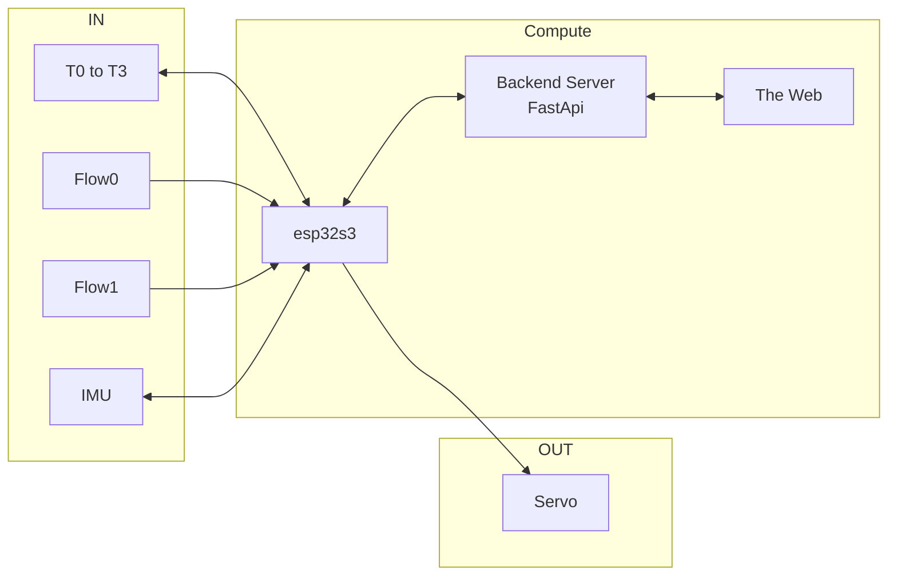
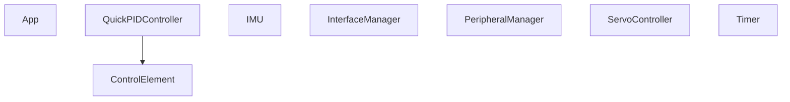
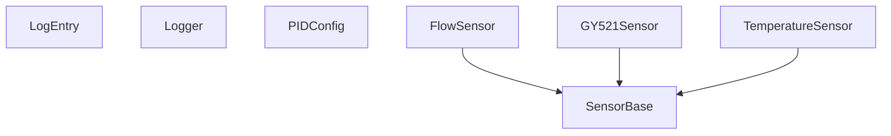

  

    
  

  

    
  





# {{page.title}}

Here is a recent one. The code is [in this github repo](https://github.com/fperron-kt88/fx-grpc-auto-detect)

  

    
    
  

This is the story of the refactoring of a double flow rate and quadruple
temperature sensing MCU on bare metal. It interfaces through grpc on
serial to a fast api backend and out to the web. An IMU and a servo were
also added, for reasons that will become apparent later.

When exposing sensors on the internet, this setup is common and effective.
Running bare metal on the MCU comes with a few responsibilities and
one could argue that an RTOS could have been a sensible choice here.
For this system though, free cycles were simply used to integrate the
inertial platform and a servo to form a tight PID loop that turned very
useful for debugging. More on this later. In hindsight, there would have
been ample space for an RTOS. So, that seed is planted now.

## General concept

The system is comprised of sensors (IN), actuators (OUT) and Computing
elements. The link between the esp32 and the backend is over serial at
115 200 Baud and the backend exposes the api over https.

Not represented in the drawing, but shown in the screenshots above, is
a minimal streamlit application that displays live data.

## Desired features

The refactor had to:

- Serve the grpc protocol to interface with the backend
- Implement the full resolution from an arbitrary number of digital temperature probes
- Measure 2 liquid flows with constant minimal resolution
- Maintain a very clear identification of:
    - any connected device (multiple esp32 could be present on the usb bus)
    - a build id
    - an api version
- Free-up sufficient computing power to maintain a PID loop in function with very smooth operation

## Software architecture

### Sensors

The class hierarchy of the project was elaborated to represent sensors
and control elements. The sensor class was derived the most, with the
definition of a FlowSensor, a TemperatureSensor and a GY521Sensor.

The abstraction of a ControlElement was thought to be a good base
to elaborate filters, PID controllers and general signal handling
black-boxes. The initial intent was to develop a registry and to enable
the composition of signal chains. While implemented from the begining, the
idea was left aside temporarily and to prioritize the basic functionality.

The IMU, based on a kalman filter, was implemented using the gyro sensor
as an input and abstracted independantly to provide sensor fusion. The
gyro used has 6 axis: acceleration and velocity respectively for the x,
y and z axis. 

A PeripheralManager class is in charge of setting up all sensors and
configure the chip.

### Interfaces

The grpc interface was abstracted and isolated from the rest of the code
since a module named SimpleRPC was used. While perfectly functional,
its interface is through function pointers and, thus, is more like a C
library. The solution to leverage the functionality was to keep all of
the interfacing in one class and through the use of static members.

## Improvements

Many improvements are required and code refactoring will start
soon. Looking at the current ojbject diagram yields something like this:

### IMU

The IMU  should probably be refactored as a SensorBase element wih 6
outputs and be lined-up with the other sensors. This would be a good
opportunity to generalize sensors with the concept of channels, an
idea that is present also in the temperature sensors all living on a
one-wire bus.

### Number of channels

Recognizing that a sensor could implement many different channels and
could be accessed using different means (buses...) presented a first
architecture decision. To keep things simple, the IMU was... 

<!--
or different algorithm
(triggered with polling, interrupt driven, simple polling). So the
Sensor should be about a physical property being measured, a channel
should be a time series or a value measured on a sensor and the whole
concept should enable to be exposed as a data source regardless of the
connection access method.

So, it became quite clear that the design required a fair amount od
tiddying-up.

So here is the rebirth of a project that exposes sensors and actuators
on the net while properly 

keeping track of devices and versions. Think

Bonus points: I got to revisit C++ strategies that I did not have to
implement in the recent past, so this came as a wonderful refresher.

## The goal

The timeframe for this one was very limited. This refactoring project
was running in parallel with the design of an FPGA interface to an hdmi
display project. Almost as if it was a mule or a testbed.

So the goal remained simple: re-implement an access mechanism to 2 flow
sensors and 4 one-wire temperature sensors, while maintaining a proper
communication channel with a backend interface and live data updates to
an FPGA driven display.

So, in essence, this projet became a shim layer between a backend in
python/fastapi and firmware in a FPGA.
-->
