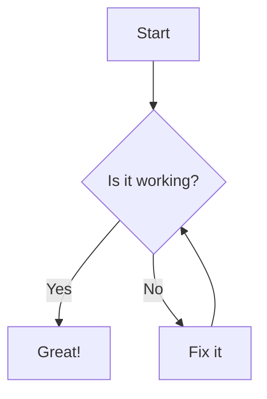

# {{page.title}}
Here is a recent one.

Projects come in all sizes and shapes. Sometimes it takes one weird turn
and you are sent back to square one, right at the architecture phase.

For this one, a few smells were already evident from the start, but the
project got along and we moved on. A few ideas came back at me and I
decided to take a few hours to revisit the concept and fix the thing.

So here is a project that exposes sensors and actuators on the net while
properly keeping track of devices and versions. Think of this as the
proverbial "full stack" development endeavor, but with a few twists. In
particular, no database was harmed in the process ;-)

Bonus points: I got to revisit C++ strategies that I did not have to
implement in the recent past, so this came as a wonderful refresher

## The goal

The timeframe for this one was very limited. This refactoring project
was running in parallel with an FPGA interface used for demonstration
purposes.

So the goal is simple: re-implement both flow sensors and 4 one-wire
temperature sensors as fast as possible, while maintaing a proper
backend interface.

So, in essence, this projet is a shim layer between a backend in python
and firmware in an FPGA.

$E=mc^2$

$$
\int_{a}^{b} x^2 dx = \frac{b^3 - a^3}{3}
$$

### Features:
- Implement the full resolution from an arbitrary number of digital temperature probes
- Measure 2 liquid flows with constant minimal resolution
- Maintain a very clear identification of: any connected device, its build id and api version

[Visit Project](https://example.com)

