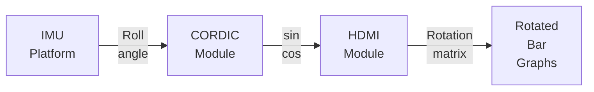





# {{page.title}}

Another recent one, this time mainly in verilog. The main
algorithm code is inline below, but I have a more comprehensive
repo with testbenches and an integration [in this github
repo](https://github.com/fperron-kt88/fx-cyclone-v-gx-video-horizon-indicator).
I can make it available to you on a limited basis if you contact me on my
[LinkedIn](https://linkedin.com/in/francoisperron).

As discussed in the [ESP32 Flow and Temperature
Project](/fx-portfolio/projects/2024/06/17/new-esp32-flow-and-temp.html)
project, an IMU platform is used to rotate an image on an hdmi screen. The
bar graphs displayed on the hdmi screen can be dynamically rotated by
an angle coming from the roll of the IMU platform.

The angle of the roll is fed into a cordic module to compute separate
sin and cos values. These values are then fed into the hdmi module to
prepare a rotation matrix used to properly rotate the pixels to display.

The CORDIC - (COordinate Rotation DIgital Computer) algorithm was
selected for the task of finding the cos and sin of an angle because it
is an interesting case of very efficient mathematical optimisation as
an iterative process that is very well suited for FPGA implementation
in a FSM (Finite State Machine) using only additions and bit shifts to
replace multiplication. It is very efficient in that very few resources
are used and that they run fast. The algorithm can be tuned to reach
high precision when required. We typically reach a precision of 0.0001
or better with this implementation.

The idea here is to first present the basic mathematical optimization. A
fixed point implementation is described next with accompanying verilog.

## Inspiration

The material is inspired from an excellent in depth blog
as [found on All about circuits on the introduction to the cordic
algorithm](https://www.allaboutcircuits.com/technical-articles/an-introduction-to-the-cordic-algorithm/)
extending it with an implementation.

## Algorithm overview

The algorithm takes an angle as an input and will output the sin and
cos components associated with this angle. One remembers that, on the
unit circle, sin represents the vertical component of the rotated vector
while cos represents its horizontal component.

The concept of the algorithm is to iteratively rotate a vector using
a set of known rotation angles until a good match is reached with the
input angle. Each successive rotation is smaller than the previous and
modifies the x and y components values of the rotating vector until the
desired precision is reached. In our case, the iteration number is 16,
regardless of the precision reached, as simulation has proven a known
performance for all input values.

The rotation mechanics is such that a starting point $(x_0, y_0)$
representing our rotating vector on the unit circle is rotated by $\theta$
to the point $(x_1, y_1)$ by:

$$
\begin{equation}
\begin{aligned}
x_1 = x_0 \cos{\theta} - y_0 \sin{\theta} \\
y_1 = x_0 \sin{\theta} + y_0 \cos{\theta}
\end{aligned}
\end{equation}
$$

Or, in matrix form:

$$
\begin{equation}
\begin{bmatrix}
x_1 \\
y_1 \\
\end{bmatrix} =
\begin{bmatrix}
\cos{\theta} & -\sin{\theta} \\
\sin{\theta} & \cos{\theta}
\end{bmatrix}
\begin{bmatrix}
x_0 \\
y_0
\end{bmatrix}
\end{equation}
$$

Starting with a vector $(x_0, y_0) = (1,0)$ along the x axis, we could use
eq.2 to find the desired components $x_1$ and $y_1$ of the rotated vector
by an angle of $\theta$, yielding the required output of $\cos{\theta}$
and $\sin{\theta}$. However this, in a weird circular reference, requires
that both $\cos{\theta}$ and $\sin{\theta}$ be computed... We will have
to work this out carefully to find a proper form that is both precise
and efficient to compute with the hardware present in an FPGA.

### The path to optimization

We have to get rid of costly multiplications. Let's consider an
iterative approach. The first order of business is to accept that we
can reconstruct any rotation angle by summing or subtracting known
rotation angles that are carefully selected. In other words, we can
always superpose our constructed vector on top of the desired one given
16 attempts at rotating it by picking into a set of precomputed angles.

To help picture these sequential rotations, we can compose transformations
based off of eq.2. Let's factor out $\cos{\theta_1}$ to represent
one rotation.

$$
\begin{equation}
\begin{bmatrix}
x_1 \\
y_1
\end{bmatrix} =
\cos{\theta_1}
\begin{bmatrix}
1 & \tan(\theta_1) \\
-\tan(\theta_1) & 1
\end{bmatrix}
\begin{bmatrix}
x_0 \\
y_0
\end{bmatrix}
\end{equation}
$$

Combining two rotations yields:

$$
\begin{equation}
\begin{bmatrix}
x_2 \\
y_2
\end{bmatrix} = \cos{\theta_2}
\begin{bmatrix}
1 & \tan(\theta_2) \\
-\tan(\theta_2) & 1
\end{bmatrix}
\cdot \cos{\theta_1}
\begin{bmatrix}
1 & \tan(\theta_1) \\
-\tan(\theta_1) & 1
\end{bmatrix}
\begin{bmatrix}
x_0 \\
y_0
\end{bmatrix}
\end{equation}
$$

Which, by grouping the terms and generalizing for n step rotations:

$$
\begin{equation}
\begin{bmatrix}
x_n \\
y_n
\end{bmatrix} =
\prod_{i=0}^{n-1} \cos{\theta_i}
\cdot
\prod_{i=0}^{n-1}
\begin{bmatrix}
1 & \tan(\theta_i) \\
-\tan(\theta_i) & 1
\end{bmatrix}
\cdot
\begin{bmatrix}
x_0 \\
y_0
\end{bmatrix}
\end{equation}
$$

This representation, while a bit more challenging to decode, yields
a few interesting properties. First, as $\cos{\theta}$ is a pair
function, it will stay positive for angles within $[-\frac{\pi}{2},
\frac{\pi}{2}]$. Then, since we are using smaller angles, $cos$ approaches
1 and in the algorithm, the product converges towards a constant number $K_{fixed} \approxeq 0.6072$.

Similarly, and since $cos$ is pair while $sin$ is odd in the considered
domain, we infer that $\tan$ will be odd. All this to say that the sign
of the angle can be factored out and the equation eq.6 really is:

$$
\begin{equation}
\begin{bmatrix}
x_n \\
y_n
\end{bmatrix} =
K_{fixed}
\cdot
\prod_{i=0}^{n-1}
\begin{bmatrix}
1 & \sigma \cdot \tan(\theta_i) \\
-\sigma \cdot \tan(\theta_i) & 1
\end{bmatrix}
\cdot
\begin{bmatrix}
x_0 \\
y_0
\end{bmatrix}
\end{equation}
$$

With $\sigma$ taking the value +1 for counterclockwise rotation and
-1 for clockwise rotations while $\theta_i$ remains always positive.

So, we got rid of some complexity, at the expense of a scaling factor
$K_{fixed}$. Since we have to start the algorithm with a vector of length
one as the first vector to be rotated, we can premultiply this vector
by a constant. All that is involved is to set $(x_0, y_0) = (K_{fixed},
0)=(0.6072, 0)$ and the multiplying factor is now baked into the algorithm.

Let's now look into the remaining operations. We are left with a constant
$K_{fixed}$ that scales a matrix product with 16 iterations. In these
matrices the $\theta_i$ are known in advance and selected for very
specific properties. Let's consider a favorable case with angles chosen
so that:

$$
\tan(\theta_i) = 2^{-i}
$$

### No more conventional multiplications

This choice leads to two very important consequences. The first
consequence of the angle selection is that the matrices all become very
easy to implement, taking n=16 as an example and all positive angle rotations:

$$
\begin{equation}
\prod_{i=0}^{n-1}
\begin{bmatrix}
1 & \tan(\theta_i) \\
-\tan(\theta_i) & 1
\end{bmatrix} =
\begin{bmatrix}
1 & 2^{0} \\
-2^{0} & 1
\end{bmatrix}
\begin{bmatrix}
1 & 2^{-1} \\
-2^{-1} & 1
\end{bmatrix}
\begin{bmatrix}
1 & 2^{-2} \\
-2^{-2} & 1
\end{bmatrix}
\ldots
\begin{bmatrix}
1 & 2^{-15} \\
-2^{-15} & 1
\end{bmatrix}
\end{equation}
$$

We effectively transformed the matrices into multiplications by powers
of 2 and, as you may have anticipated, these are equivalent to very
simple and efficient bit shifts. All of the operations required within
the $\prod$ are now signed additions or sign extended bit shifts. These
happen to map very efficiently to hardware ressources in an FPGA. No
more conventional multiplications whatsoever.

### Sign selection process

Let's take a closer look at the signs of the angles. We just presented
a case with the product of 16 rotation steps with positive $\theta_i$.

Talking about the angles, the second consequence of their specific
selection is that these $\theta_i$ are all precomputed and equal to
$\theta_i = \arctan(2^{-i})$. This yields a series of 16 progressively
smaller angle increments at our disposal that converge to be about half
of the preceding one. The first angle is $\frac{\pi}{4}$, the last angle
being $\arctan(2^{-15}) \approxeq 0.00003$, or less than $0.002 ^\circ$.

Selectively adding or subtracting these angles can lead to reconstruct
just about any angle between $[-\frac{\pi}{2}, \frac{\pi}{2}]$ to within
$0.00003$ rad.

### Putting it all together

So, on one side we have a very easy to compute rotation matrix using
any of the $\tan(\theta_i)$ values, and on the other side we have
very specific angles that we know in advance and that are associated
with each and every easy to compute rotation matrix.

The last part of the puzzle to understand the CORDIC algorithm is to
recognize that by carefully selecting the sign of these 16 rotations,
one can reconstruct on the fly just about any angle in the range. And the
algorithm does just about that: step rotations are performed starting with
the bigger angles and through to the smallest. The x and y components
of the rotated output vector are summed up at each step, representing
the cos and sin of the internal vector chasing the requested angle.

The real kicker is that the algorithm will just pick the next rotation as
either a positive or a negative one and so that the vector would end up
closest to the desired angle after the 16 rotations. This is a feedback
loop of sorts that uses imposed angles but decides if it should add or
subtract the angle to its own advantage in the goal of ending on the
required final angle.

The result is that the 16 rotations will bring the reconstructed angle
of the internal vector closer to the desired angle until they match
to within the precision required. The components at that moment, the x
and y values, are the cos and sin of the reconstructed angle and very
closely match the ones for the requested angle.

## Fixed point math

A small note here on the fact that the algorithm and all internal
constants are prescaled by a factor $2^{15}$ or $32768$ since most of
the internal computations represent values not much larger than 1 in
absolute value. In the code, arbitrary register width can be used as
long as the ressources are available.

## Verilog code

Here is the verilog code to implement the algorithm.


module cordic #(
// Internal parameters and signals
parameter INTERNAL_WIDTH = 17,
parameter IO_WIDTH = 17,
parameter ITERS = 16,
parameter PREFIX = 15,

    parameter [INTERNAL_WIDTH-1:0] K_FIXED =
        (PREFIX == 15) ? {INTERNAL_WIDTH{1'b0}} | 15'sh4dba :
        (PREFIX == 16) ? {INTERNAL_WIDTH{1'b0}} | 16'sh9b75 :
        (PREFIX == 17) ? {INTERNAL_WIDTH{1'b0}} | 17'sh136ea :
        {INTERNAL_WIDTH{1'b0}} // Default value if PREFIX does not match

)(
input wire clk,
input wire reset,
input wire signed [IO_WIDTH-1:0] angle_in,// Angle in fixed-point format (16-bit)
output reg signed [IO_WIDTH-1:0] cos_out, // 16 bits Cosine output in fixed-point
output reg signed [IO_WIDTH-1:0] sin_out, // 16 bits Sine output in fixed-point
output reg ready // Data ready signal
);

    reg signed [INTERNAL_WIDTH-1:0] x, y, alpha, theta;
    reg [4:0] step;                     // Iteration step counter
    reg running;                        // Indicates if the computation is in progress

    // Precomputed arctangent values (in fixed-point format, scaled by 2^16)
    reg [15:0] atan_table [0:15];
    initial begin
        atan_table[ 0] = 16'h6488; // atan(2^-0) * 2^15
        atan_table[ 1] = 16'h3b59; // atan(2^-1) * 2^15
        atan_table[ 2] = 16'h1f5b; // atan(2^-2) * 2^15
        atan_table[ 3] = 16'h0feb; // atan(2^-3) * 2^15
        atan_table[ 4] = 16'h07fd; // atan(2^-4) * 2^15
        atan_table[ 5] = 16'h0400; // atan(2^-5) * 2^15
        atan_table[ 6] = 16'h0200; // atan(2^-6) * 2^15
        atan_table[ 7] = 16'h0100; // atan(2^-7) * 2^15
        atan_table[ 8] = 16'h0080; // atan(2^-8) * 2^15
        atan_table[ 9] = 16'h0040; // atan(2^-9) * 2^15
        atan_table[10] = 16'h0020; // atan(2^-10) * 2^15
        atan_table[11] = 16'h0010; // atan(2^-11) * 2^15
        atan_table[12] = 16'h0008; // atan(2^-12) * 2^15
        atan_table[13] = 16'h0004; // atan(2^-13) * 2^15
        atan_table[14] = 16'h0002; // atan(2^-14) * 2^15
        atan_table[15] = 16'h0001; // atan(2^-15) * 2^15
    end

    always @(posedge clk or posedge reset) begin
        if (reset) begin
            // Reset all registers and signals
            x <= 0;
            y <= 0;
            theta <= 0;
            alpha <= 0;
            step <= 0;
            running <= 0;
            ready <= 0;
            cos_out <= 0;
            sin_out <= 0;
        end else if (!running) begin
                x <= K_FIXED;     // Premult by K_FIXED, the CORDIC gain
                y <= 0;
                theta <= 0;
                alpha <= angle_in;  // Load the input angle with sign extension
                step <= 0;
                running <= 1;
                ready <= 0;
        end else if (running) begin
            // Perform CORDIC iteration
            if (step < (ITERS-1)) begin       // 0 indexed
                // Compute sigma and update coordinates
                if (theta < alpha) begin
                    // sigma = +1
                    theta <= theta + atan_table[step];
                    x <= x - (y >>> step);    // x - y / 2^step, CCW rotation matrix approx.
                    y <= y + (x >>> step);    // y + x / 2^step, CCW
                end else begin
                    // sigma = -1
                    theta <= theta - atan_table[step];
                    x <= x + (y >>> step);    // x + y / 2^step, CW
                    y <= y - (x >>> step);    // y - x / 2^step, CW
                end
                step <= step + 5'sh01;
            end else begin
                cos_out <= x;
                sin_out <= y;
                ready <= 1;                   // Output are exposed and ready
                running <= 0;                 // Stop the computation
            end
        end
    end

endmodule


## Algorithm description

Verilog could be a bit hard on the eyes at first if you are not familiar
with it. However, we can very clearly identify a few important lines
that convey the grunt of the work, and these are easy to decipher.

### Black box: inputs and outputs

Looking at the code in terms of a black box, lines 14 to 19 define the
interface: a clk input with a reset, then an angle_in input. So, once
started and out of reset, the module will first read the angle_in to
start the 16 step process.

The cos and sin outputs are trivial: they will contain the desired
answer when the ready signal is raised. And that is pretty much it,
from a high level perspective.

### The guts

From the inside now, let's look at lines 61 to 67. There we see the
mechanism getting ready to start a computation cycle. The internal vector
is set in lines 61 and 62 to $(K_{fixed}, 0)$, right on the x axis at
$0^\circ$ with the premultiplied length. The internal angle goes to 0
on line 63 while the desired final angle is set to the value read from
the input port: alpha is set to angle_in at line 64.

The 16 step counter is set to zero at line 65, then the module
announces the start of a computation by raising running and lowering
ready respectively on lines 66 and 67. All is set now to compute the
new sin and cos values of the angle_in as requested.

  

    
  

This can clearly be verified on the ModelSim timing diagram image here
if you look at the time step 20760ns. You might want to click on the
image to let it open in a separate tab and scroll around...

Notice how the value 0x0477d is in the angle_in and the alpha registers
while 0x04dba and 0 are in the x and y registers.

Let's now focus on the iterations proper. Notice how the step counter is
at 0x00 for the full clock period between 20760 and 20770ns. The step
counter will then count to 0x0f before the sin and cos are exposed as
the valid answer at 20920ns.

The step counter hardware is synthesized properly in the FPGA because
we told verilog that the counter should count up by a step of 1 (line
83) until 0x0f is reached (line 70). What happens between these lines,
and as already presented above with the equations, is split in two
main activities:

-   rotating the internal vector
-   tracking the value of theta while we chase the desired alpha

### Rotating the internal vector

Let's start with the rotation of the vector. Lines 75,76 or 80,81
told verilog to setup essentially the same computation tasks, albeit
each one specialized in a single direction.  We see x on line 75 being
transformed by the optimized matrix rotation. In essence, we take
the old value of x and add the value of y but bit shifted to the right
by the value of step.

You can see the gradual rotation of the coordinates in the x and y traces
on the timing diagram. Each step brings x and y closer to the expected
answer values with decreasing adjustments as the shifting gets more
intense with the step increase.

From a hardware perspective, both data paths for the positive and
negative rotations were probably optimized into a single one with
different settings, but the general idea remains that a full adder is at
the center of all this. Being fed by either the full precedent value of
itself and a selectively bit shifted version of either x and y. Are these
being implemented as a real shift register or some bit field multiplexer
could be validated by looking at the synthesis and placement reports, but
one thing remains: the simulation with static timing runs the complete
operation in one cycle at 100MHz without any perceived effort and the
real FPGA runs the module at 50MHz without a glitch either.

### Tracking the value of theta

The angle tracking is governed by the test at line 72 that will select
the rotation direction based on the current value of theta compared to
the desired angle.

Lines 74 and 79 add or subtract the actual angle imparted by the rotation
using the precomputed values.

On the timing traces, we can clearly see how the initial theta of 0x0000
is gradually adjusted to match the value of alpha as close as possible:
0x477e instead of the desired 0x477d. Interestingly, the value of sigma
has been traced to have a 1 representing a positive rotation and 0 for a negative
rotation. We see how the algorithm used a series of positive and negative
rotations to closely match the desired angle.

### Performance

The algorithm, once translated into verilog and instantiated into a
cyclone V FPGA, can easily produce 17 bit precision numbers within a
packed 16+1 clock cycles pipeline. This means that a single cordic unit
running at 50MHz can easily output the values within 170ns of being
presented with an input. More than 5.8 million updates per second. The
sin and cos errors are within an absolute error of 0.0002 and the
concentricity error (Pythagorean length) is within 0.0004 units of the
unit circle. That is 0.02% error on the sin or cos and 0.04% error on
the concentricity.

# Test and validation

  

    
    
  

An test bench has been written as well as a set of accompanying C programs
to validate the results and achieved resolution/precision. The
programs also automatically precompute the fixed arctan table
and the $K_{fixed}$ constants and has been implemented for the
floating point theoretical version as well as for the fixed point
integer, as implemented in HW, version.

On the stacked simulation images on the right, you can see some of the
outputs of the test bench and the idea that all of the possible angles
have been fed to the cordic in simulation to predict the performance and
validate the proper values. Each output is tested for the expected value,
the error and the Pythagorean norm error (eccentricity).

Leave me a message on my
[LinkedIn](https://linkedin.com/in/francoisperron) if you want to know
more about this.

# Conclusion

The thing works beautifully.

The algorithm, as designed, can also be extended to near arbitrary width and
step sizes with regards to modern FPGAs. It consumes much less than 1%
of the ressources of a cyclone V (5CGXFC5C6F27).

If you want to see the algorithm at work, please look into the project
YouTube video where the roll input of the IMU is sent to this cordic to compute
the cos and sin values used to rotate a bar graph in real time. Smooth!

Don't forget to <a href="javascript:;"
onclick="tidioChatApi.display(true);tidioChatApi.open()">subscribe in
the chat</a> and comeback soon!
